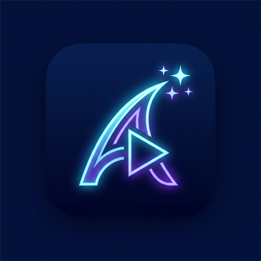
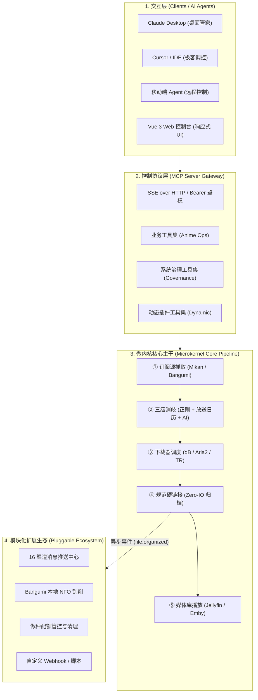

# Ani-Go

<div align="center">

<p align="center">
  <br>
  <strong>极轻量、高性能的自动化追番、下载、整理与媒体库集成系统</strong><br>
  <em>Lightweight, high-performance automated anime subscription, download, organization, and media library system</em>
</p>

<p align="center">
  <a href="https://github.com/xiaoyueRX/Ani-Go/releases"></a>
  
  
  
  
  
  <a href="LICENSE"></a>
</p>

<p align="center">
  <a href="#-系统架构与核心设计">系统架构</a> •
  <a href="#-核心特性">核心特性</a> •
  <a href="#-快速开始">快速开始</a> •
  <a href="#-核心配置说明">配置说明</a> •
  <a href="docs/00_DESIGN_PHILOSOPHY.md">设计准则</a> •
  <a href="docs/01_ARCHITECTURE.md">架构白皮书</a> •
  <a href="docs/02_PLUGIN_SPEC.md">插件规范</a> •
  <a href="docs/03_MCP_SPEC.md">MCP 协议</a> •
  <a href="docs/04_AUTOPARSER_SPEC.md">全自动消歧</a> •
  <a href="docs/05_DEPLOYMENT.md">NAS 部署</a> •
  <a href="README_EN.md">English</a>
</p>

</div>

---

## 📖 项目简介

**Ani-Go** 是一款专为家庭 NAS 与轻量级服务器设计的一站式番剧自动化管理系统。后端基于 Go 语言构建，前端采用 Vue 3 + TailwindCSS，全量静态资源内置于单文件二进制中（`go:embed`），实现零外部运行时依赖的即装即用体验。

系统严格遵循**微内核（Microkernel）与插件解耦**设计哲学：主干专注处理高效、稳定的核心流水线闭环；非核心功能（如消息推送中心、NFO 刮削、数据迁移等）以独立插件形式挂载，支持按需启用与完整资源释放。空载常驻运行内存控制在 **15MB ~ 30MB**，空载 CPU 占用恒为 **0.0%**，即使在 J1900、N3450、树莓派等低功耗设备上亦能长效稳定运行。

---

## 🏗️ 系统架构与核心设计



### 架构设计准则
- **微内核主干（Core）**：仅聚焦「订阅抓取 ──► 标题与集数消歧 ──► 下载调度 ──► 规范硬链接 ──► 交付播放」五步核心闭环，保证系统轻量与低心智负担。
- **模块化插件（Plugin）**：非核心功能统一作为插件管理。当插件停用时，后台协程立即销毁，事件监听与网络请求清零，实现彻底的资源释放。
- **故障隔离机制（Fault Isolation）**：外部插件、通知推送与脚本回调均具备 `defer recover()` 异常隔离机制，插件局部异常不影响核心流水线。
- **外部智能体驱动（MCP Server）**：原生实现 Anthropic Model Context Protocol 标准（SSE over HTTP + Bearer Token），无需内置庞大 LLM 运行时，即可让外部 Claude/Cursor 远程理解意图并驱动追番与系统运维。

---

## ✨ 核心特性

### ⚡ 极轻量微内核底盘 (Microkernel & Low Resource)
- **极简资源消耗**：常驻运行内存仅需 **15MB ~ 30MB**，空载 CPU **0.0%**。
- **单文件无依赖分发**：纯 Go 编译，内置纯 Go SQLite 引擎（无 CGO 依赖），前端产物完整内嵌，无需配置复杂环境。
- **低功耗设备亲和**：针对 J1900、N3450、各类工控机、树莓派 4B 及轻量 NAS 进行专门优化。

### 🧠 三级自动消歧引擎 (Three-Tier Disambiguation Engine)
- **第一级（本地正则剥离）**：0ms 极速剥离分辨率（1080p/4K）、压制规格（HEVC/Ma10p）、字幕组前缀与季度标签，覆盖 90% 规范标题。
- **第二级（官方放送日历对齐）**：遇到模糊集数（如第二季标注为第25集）时，自动将种子发布时间（`pubDate`）与 Bangumi 官方单集放送时间戳进行窗口比对，**0 Token 化解绝大多数歧义**。
- **第三级（大模型上下文兜底）**：针对极少数生僻特别篇，在注入番剧背景上下文的前提下调用大模型辅助解析，配备持久化本地缓存（`parser_cache`）与每日调用限额熔断保护。

### ⬇️ 多下载器支持与运行时热切换 (Multi-Downloader & Hot Swap)
- **qBittorrent**：原生深度集成，支持分类标签、自动做种生命周期控制（依据时长与分享率达标后自动清理）。
- **Aria2**：极速 RPC 调度，支持任务移除与磁盘残留物理清理。
- **Transmission**：轻量级下载客户端支持。
- **运行时热切换 (Dynamic Downloader)**：在 Web 设置界面即可即时切换活跃下载器，无需重启进程。
- **队列实时监控**：实时查看任务进度、传输速率、做种状态与死种检测标记。

### 🗂️ 规范化媒体整理与 Zero-IO 硬链接 (Zero-IO Hardlink Organization)

- **主流流媒体标准结构**：完全兼容 **Jellyfin / Plex / Emby / fnOS** 刮削标准，自动处理路径非法字符：
  ```
  TV/番剧/
  └── 葬送的芙莉莲/
      └── Season 01/
          ├── 葬送的芙莉莲 - S01E01.mp4
          └── 葬送的芙莉莲 - S01E02.mp4
  ```
- **分类存储与模板定制**：
  - 番剧 (TV)：`TV_BASE_PATH`（默认 `./TV/番剧`）与 `TV_TEMPLATE` 自定义命名
  - 剧场版 (Movie)：`MOVIE_BASE_PATH`（默认 `./TV/剧场版`）与 `MOVIE_TEMPLATE`
  - 特别篇 (Special)：`OVA_BASE_PATH`（默认 `./TV/OVA`）与 `OTHER_TEMPLATE`
- **Zero-IO 硬链接模式**：首推硬链接整理，瞬间生成媒体文件且零双倍磁盘占用，源文件可继续于下载器中正常做种。
- **自定义正则 10 槽位沙箱**：提供 10 组自定义解析规则与实时测试沙箱，输入任意标题即刻校验季集提取效果。

### 🤖 Model Context Protocol (MCP) 智能体支持
- **标准 MCP Server 原生集成**：支持 SSE over HTTP 传输与 Bearer Token 安全鉴权。
- **全套追番与治理工具**：向外部智能体暴露搜索、订阅管理、下载队列控制、插件启停热重载及系统设置工具。
- **客户端一键接入**：支持主流客户端（Claude Desktop、Cursor、Dify、Open WebUI），提供开箱即用的配置模版与提示词指南。

### 🔔 全 16 渠道通知中心与热重载 (Unified Notification Matrix)
- **16 大主流推送渠道全覆盖**：
  - 💬 **即时通讯**：Telegram、企业微信、飞书、钉钉、QQ (OneBot 协议 / NapCat / Lagrange)
  - 📱 **移动端推送**：Bark (iOS)、Server酱、Pushover、LINE、WhatsApp、Signal
  - 🌐 **开放 Webhook 与自建**：Discord、Slack、Gotify (自建)、Ntfy (自建/官方)、Matrix (Element)
  - 📧 **邮件**：标准 SMTP 协议多收件人直发
- **调度与稳定性保障**：基于 `v2.NotifyManager` 架构，支持优先级队列、指数退避重试与履历监控看板。
- **免重启热生效**：设置修改即刻热重载生效，各渠道均支持独立连通性测试。

### 📺 智能新番日历与多数据源协同 (Smart Schedule & Sources)
- **多数据源灵活协同**：
  - **蜜柑计划 (Mikan Project)**：官方全量新番数据源，支持 2000~2026 跨季度历史回溯。
  - **Bangumi (bgm.tv) 每日放送**：集成官方放送日历，与年份/季度选择器联动。
  - **長門番堂 (yuc.wiki) 插件**：内置可选数据源插件，按需无缝切换。
- **多站点聚合搜索**：支持 Mikan、AnimeTosho、Nyaa、ACG.RIP 聚合检索。
- **智能镜像测速与回退**：内置国内外多镜像节点，后台自动测速择优切换。

### 💻 现代化响应式设计与 PWA (Modern UI & PWA)
- **桌面端视口锁定侧边栏**：纵向长列表浏览时侧边栏保持吸顶锁定，高频操作触手可及。
- **移动端沉浸式体验**：底部导航栏完美适配全面屏手势与安全区域，支持独立移动端抽屉导航。
- **PWA 桌面/移动端应用**：支持将 Web 页面一键安装至桌面或手机主屏，作为独立客户端流畅运行。
- **中英双语国际化 (i18n)**：全界面文本、状态提示、设置项与日志即时中英文切换。

---

## 🚀 快速开始

### 方式一：Docker Compose（推荐）

1. 克隆代码仓库：
```bash
git clone --depth 1 https://github.com/xiaoyueRX/Ani-Go.git
cd Ani-Go
```

2. 准备配置文件：
```bash
cp .env.example .env
# 编辑 .env，填入 MIKAN_RSS_URL、下载器连接信息与存储目录
vim .env
```

3. 启动容器：
```bash
docker compose up -d
```

4. 访问 `http://localhost:20001`：
   - **默认管理员账号**：`admin`
   - **默认管理员密码**：`admin`
   *(首次登录后请立即前往「设置」修改密码)*

---

### 方式二：单文件独立运行

从 [Releases](https://github.com/xiaoyueRX/Ani-Go/releases) 页面下载对应系统的最新预编译二进制，或在 Linux / macOS 执行一键脚本：

```bash
# Linux / macOS 一键安装与配置
curl -fsSL https://raw.githubusercontent.com/xiaoyueRX/Ani-Go/main/install.sh | sh

# 启动服务（前端静态资源已完整内嵌在二进制内）
anigo
```

浏览器打开 `http://localhost:20001` 即可使用。

---

### 方式三：源码手动构建

需要环境：Go 1.25+，Node.js 18+，npm

```bash
# 1. 克隆代码仓库
git clone https://github.com/xiaoyueRX/Ani-Go.git
cd Ani-Go

# 2. 构建前端
cd web
npm install
npm run build
cd ..

# 3. 编译后端（静态嵌入前端产物）
go build -o anigo .

# 4. 运行
./anigo
```

---

## ⚙️ 核心配置说明

完整配置参见 [`.env.example`](.env.example)，常用核心配置项如下：

| 环境变量 | 说明 | 默认值 | 示例 / 说明 |
| :--- | :--- | :--- | :--- |
| `PORT` | 服务监听端口 | `20001` | `20001` |
| `MIKAN_RSS_URL` | 蜜柑计划个人订阅 RSS 地址 | 无 | `https://mikanani.me/RSS/MyBangumi?token=xxx` |
| `DEFAULT_DOWNLOADER`| 默认下载器类型 | `qbittorrent`| `qbittorrent` / `transmission` / `aria2` |
| `QB_HOST` | qBittorrent WebUI 地址 | `http://localhost:8081` | `http://192.168.1.10:8081` |
| `QB_USER` / `QB_PASS` | qBittorrent 账号与密码 | `admin` / 空 | `admin` / `password` |
| `ARIA2_HOST` / `ARIA2_SECRET` | Aria2 RPC 地址与密钥 | 空 | `http://192.168.1.10:6800` |
| `TV_BASE_PATH` | 番剧媒体库整理根目录 | `./TV/番剧` | 宿主机或容器挂载路径，如 `/data/media/anime` |
| `MOVIE_BASE_PATH` | 剧场版媒体库整理根目录 | `./TV/剧场版` | 宿主机或容器挂载路径，如 `/data/media/movies` |
| `OVA_BASE_PATH` | OVA/特别篇媒体库整理根目录 | `./TV/OVA` | 宿主机或容器挂载路径，如 `/data/media/ova` |
| `USE_HARDLINK` | 整理模式是否使用硬链接 | `false` | `true` (推荐) / `false` (移动) |
| `MCP_ENABLED` | 是否启用 MCP Server 服务 | `false` | `true` / `false` |
| `MCP_AUTH_TOKEN` | MCP 接口鉴权 Bearer 密钥 | 空 | 建议配置为高强度随机字符串 |
| `AI_PROTOCOL` / `AI_API_KEY` | AI 协议与密钥 | `openai` / 空 | `openai` / `google` / `anthropic` / `ollama` |
| `AI_DAILY_QUOTA_LIMIT` | AI 每日消歧调用上限 | `30` | 超过限额自动暂停并提示，防止非预期费用 |

---

## 🔒 部署与安全规范

1. **存储挂载规范（规避跨卷硬链接失效）**：
   硬链接不能跨物理分区，也不能在 Docker 容器内跨不同的 Volume 挂载点。**务必将下载目录与媒体库目录置于同一个父目录下，并在容器中统一挂载**：
   ```yaml
   volumes:
     - /volume1/data:/data  # 统一单卷挂载！
   ```
   此时配置下载路径为 `/data/downloads`，媒体库路径为 `/data/media/anime`，即可实现瞬间零磁盘占用的硬链接整理。详见 [docs/05_DEPLOYMENT.md](docs/05_DEPLOYMENT.md)。

2. **网络安全基线**：
   - 默认端口 `20001` 请勿在路由器中直接通过 DMZ 或 UPnP 裸露至公网。
   - 推荐通过内网穿透与虚拟专网（Tailscale、WireGuard）或前置反向代理（Nginx / Caddy + HTTPS）访问。
   - 首次登录后请务必修改默认初始密码（`admin` / `admin`）。

---

## ⚠️ 免责声明 (Disclaimer)

1. **项目性质**：本项目（Ani-Go）为个人技术研究与自动化媒体库管理辅助工具，仅用于个人学习交流及自建家庭媒体库整理，严禁用于商业牟利或营利性视听服务分发。
2. **内容声明**：本项目自身不托管、不存储、不提供且不分发任何音视频资源或种子文件，仅提供本地调度与文件重命名整理等工具属性能力。
3. **数据来源与版权**：系统检索与展示的数据均来自第三方公开互联网索引平台（Mikan Project、Bangumi、TMDB、Nyaa、yuc.wiki 等），各数据源版权与责任由原平台及发布者所有。
4. **风险承担**：使用者在下载及使用网络资源时应自觉遵守当地法律法规。因不当使用所产生的一切责任与损失由使用者自行承担，与本项目无关。

---

## 🤝 鸣谢与致敬

- [Mikan Project (蜜柑计划)](https://mikanani.me/) — 优质的新番 RSS 与索引数据源
- [Bangumi (番组计划)](https://bgm.tv/) — 高质量中文动漫数据库与元数据索引
- [長門番堂 (yuc.wiki)](https://yuc.wiki/) — 优质新番季风表数据源
- [Vue.js](https://vuejs.org/) & [DaisyUI](https://daisyui.com/) & [TailwindCSS](https://tailwindcss.com/)

---

## 📄 开源许可证

本项目基于 [MIT License](LICENSE) 开源发布。欢迎提交 Issue 与 Pull Request！
