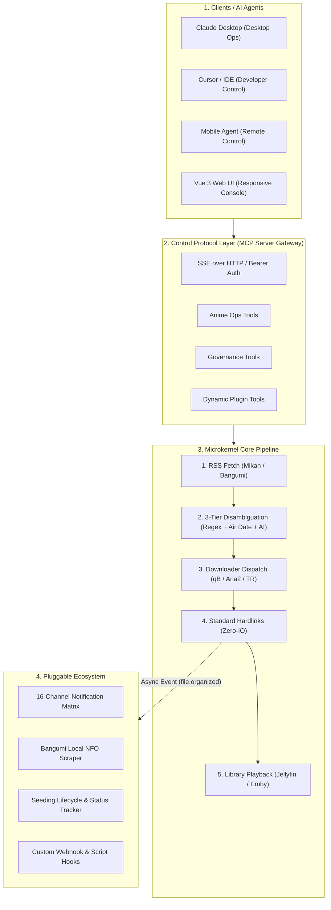

# Ani-Go

<div align="center">

<p align="center">
  <br>
  <strong>Ultra-lightweight, high-performance automated anime tracking, download, organization & media library system</strong><br>
  <em>极轻量、高性能的自动化追番、下载、整理与媒体库集成系统</em>
</p>

<p align="center">
  <a href="https://github.com/xiaoyueRX/Ani-Go/releases"></a>
  
  
  
  
  
  <a href="LICENSE"></a>
</p>

<p align="center">
  <a href="#-system-architecture">Architecture</a> •
  <a href="#-features">Features</a> •
  <a href="#-quick-start">Quick Start</a> •
  <a href="#-configuration">Configuration</a> •
  <a href="docs/00_DESIGN_PHILOSOPHY.md">Design Philosophy</a> •
  <a href="docs/01_ARCHITECTURE.md">Architecture Whitepaper</a> •
  <a href="docs/02_PLUGIN_SPEC.md">Plugin Spec</a> •
  <a href="docs/03_MCP_SPEC.md">MCP Spec</a> •
  <a href="docs/04_AUTOPARSER_SPEC.md">Auto-Disambiguation</a> •
  <a href="docs/05_DEPLOYMENT.md">NAS Deployment</a> •
  <a href="README.md">中文版本</a>
</p>

</div>

---

## 📖 Introduction

**Ani-Go** is an all-in-one anime automation management system designed specifically for home NAS and low-power servers. Built with Go on the backend and Vue 3 + TailwindCSS on the frontend, static assets are embedded directly into a single standalone binary (`go:embed`), delivering a zero-runtime-dependency, out-of-the-box experience.

The system adheres strictly to the **Microkernel and Plugin Decoupling** design philosophy: the core pipeline focuses on an efficient and reliable 5-step loop; non-essential features (such as notifications, NFO scraping, and data migration) operate as isolated plugins that can be enabled on demand with complete resource cleanup when disabled. Idle resident memory is kept within **15MB ~ 30MB**, with idle CPU consumption at **0.0%**, ensuring long-term stable operation even on low-spec hardware like J1900, N3450, and Raspberry Pi.

---

## 🏗️ System Architecture



### Key Architectural Guidelines
- **Microkernel Core**: Strictly focuses on the 5-step loop: RSS Fetching ──► Disambiguation ──► Downloader Dispatch ──► Zero-IO Hardlinking ──► Playback Delivery.
- **Pluggable Extensions**: Non-core features are managed as modular plugins. When a plugin is disabled, its background goroutines are destroyed, and network requests drop to zero.
- **Fault Isolation**: External plugins and script hooks run inside `defer recover()` boundaries, ensuring plugin errors never crash the core pipeline.
- **Native MCP Server**: Natively implements the Anthropic Model Context Protocol standard (SSE over HTTP + Bearer Token), allowing external Claude/Cursor instances to control anime tracking and system administration.

---

## ✨ Features

### ⚡ Ultra-Lightweight Microkernel & Low Resource Footprint
- **Minimal Resource Footprint**: Resident memory of **15MB ~ 30MB**, idle CPU at **0.0%**.
- **Single Binary Distribution**: Pure Go compilation with pure Go SQLite (zero CGO), fully embedded web assets.
- **Low-Power Friendly**: Tailored for J1900, N3450, industrial PCs, Raspberry Pi 4B, and NAS platforms (fnOS, Synology, Unraid).

### 🧠 Three-Tier Auto-Disambiguation Engine
- **Tier 1 (Local Regex Stripping)**: 0ms extraction removing resolutions (1080p/4K), encoding tags (HEVC/Ma10p), fansub prefixes, and season markers (~90% coverage).
- **Tier 2 (Air Date Timestamp Grounding)**: For ambiguous episode numbers (e.g. S2 marked as Ep 25), correlates torrent `pubDate` against official Bangumi episode broadcast calendars to resolve ambiguities with **zero token cost**.
- **Tier 3 (Context-Grounded LLM Fallback)**: For rare special episodes, injects anime context into LLMs with persistent SQLite caching (`parser_cache`) and a daily quota fuse to prevent unexpected API costs.

### ⬇️ Multi-Downloader Matrix & Dynamic Hot Swap
- **qBittorrent**: Native API integration with category tagging and automatic seeding lifecycle management (ratio & seed time).
- **Aria2**: High-speed RPC dispatch with cascading task removal and physical disk residue cleanup.
- **Transmission**: Lightweight torrent client support.
- **Dynamic Hot Swap**: Switch active downloaders on the fly from the Web Settings UI without restarting the server.
- **Real-Time Queue Dashboard**: Monitor progress, transfer rates, seeding status, and dead torrent indicators in real time.

### 🗂️ Standard Media Library Organization & Zero-IO Hardlinks

- **Industry-Standard Naming Conventions**: Strictly compliant with **Jellyfin / Plex / Emby / fnOS** guidelines:
  ```
  TV/Anime/
  └── Frieren Beyond Journey's End/
      └── Season 01/
          ├── Frieren Beyond Journey's End - S01E01.mp4
          └── Frieren Beyond Journey's End - S01E02.mp4
  ```
- **Zero-IO Hardlink Mode**: Instant file creation with zero duplicate disk space; source files continue seeding in torrent clients without interruption.
- **Custom Regex 10-Slot Sandbox**: Configure up to 10 customized pattern rules with an interactive live sandbox tester.

### 🤖 Model Context Protocol (MCP) Agent Support
- **Standard MCP Server**: SSE over HTTP transport with Bearer Token authentication.
- **Comprehensive Ops Tools**: Exposes anime search, subscription management, queue control, plugin toggles, and system config to external AI agents.
- **Client Ready**: Out-of-the-box configuration templates and prompt guidelines for Claude Desktop, Cursor, Dify, and Open WebUI.

### 🔔 Unified 16-Channel Notification Matrix
- **Full Coverage Across 16 Platforms**: Telegram, WeChat Work, Feishu, DingTalk, QQ (OneBot), Bark, ServerChan, Pushover, LINE, WhatsApp, Signal, Discord, Slack, Gotify, Ntfy, and SMTP Email.
- **Reliable Dispatching**: Priority queue buffering, exponential backoff retries, and delivery rate monitoring.

---

## 🚀 Quick Start

### Option 1: Docker Compose (Recommended)

```bash
git clone --depth 1 https://github.com/xiaoyueRX/Ani-Go.git
cd Ani-Go
cp .env.example .env
# Edit .env with your MIKAN_RSS_URL, downloader settings, and storage paths
docker compose up -d
```
Access `http://localhost:20001` (Default credentials: `admin` / `admin`).

---

### Option 2: Standalone Binary

Download the pre-compiled binary from [Releases](https://github.com/xiaoyueRX/Ani-Go/releases), or run the one-line install script on Linux/macOS:

```bash
curl -fsSL https://raw.githubusercontent.com/xiaoyueRX/Ani-Go/main/install.sh | sh
anigo
```

---

## ⚙️ Configuration

Refer to [`.env.example`](.env.example) for the full configuration guide. Key parameters:

| Variable | Description | Default | Example |
| :--- | :--- | :--- | :--- |
| `PORT` | Web & API Listening Port | `20001` | `20001` |
| `MIKAN_RSS_URL` | Mikan Personal RSS URL | None | `https://mikanani.me/RSS/MyBangumi?token=xxx` |
| `DEFAULT_DOWNLOADER`| Default Downloader | `qbittorrent`| `qbittorrent` / `transmission` / `aria2` |
| `QB_HOST` | qBittorrent WebUI Address | `http://localhost:8081` | `http://192.168.1.10:8081` |
| `TV_BASE_PATH` | TV Media Library Path | `./TV/番剧` | `/data/media/anime` |
| `USE_HARDLINK` | Enable Hardlinks | `false` | `true` (recommended) |
| `MCP_ENABLED` | Enable MCP Server | `false` | `true` / `false` |
| `MCP_AUTH_TOKEN` | Bearer Token for MCP | Empty | Random secure string |
| `AI_DAILY_QUOTA_LIMIT` | Daily LLM Parsing Limit | `30` | Prevents runaway API bills |

---

## 🔒 Deployment & Security

1. **Single-Volume Mount Rule (Prevent Hardlink Failures)**:
   Hardlinks cannot cross different Docker volume mount points or physical partitions. **Always mount downloads and media libraries under a unified root volume**:
   ```yaml
   volumes:
     - /volume1/data:/data  # Single unified mount
   ```
   Set download path to `/data/downloads` and library to `/data/media/anime`. See [docs/05_DEPLOYMENT.md](docs/05_DEPLOYMENT.md).

2. **Security Baseline**:
   - Do not expose port `20001` directly to the public internet via DMZ or UPnP.
   - Use internal networks (Tailscale, WireGuard) or secure reverse proxies (Nginx / Caddy + HTTPS).
   - Change the default password (`admin` / `admin`) immediately after first login.

---

## ⚠️ Disclaimer

1. **Personal Use Only**: Ani-Go is an open-source technical research and media automation tool intended solely for personal study, technical research, and self-hosted media management. Commercial use or public distribution of copyrighted media is strictly prohibited.
2. **No Content Stored**: Ani-Go does not host, store, stream, or distribute any media content or torrent files. It acts purely as a local scheduler and file organizer.
3. **Data Sources**: Metadata, schedules, and RSS feeds are retrieved from third-party public platforms (Mikan Project, Bangumi, TMDB, Nyaa, yuc.wiki). All rights belong to their respective copyright holders.

---

## 📄 License

Released under the [MIT License](LICENSE). Contributions, issues, and PRs are welcome!
