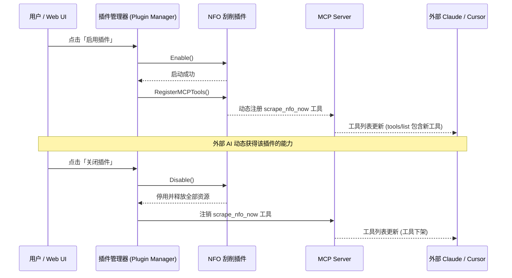

# Ani-Go 插件开发规范与自描述指南 (Plugin Specification)

## 1. 插件设计核心准则

在 Ani-Go 中，插件系统的唯一目的不是为了堆砌臃肿功能，而是**为了通过彻底隔离与电闸机制，保护微内核主干的纯粹与轻量**。

### 插件设计要求：
1. **资源彻底释放（Resource Cleanup & Killswitch）**：当用户在设置中将插件切换为「禁用」时，插件的所有后台 Goroutine 必须立即退出，事件订阅全部解除，MCP 工具立即卸载。系统表现与该插件未启用状态完全一致。
2. **异常故障隔离（Fault Tolerance）**：插件运行出现未捕获异常时，错误必须被插件边界捕获并记录日志，避免影响主进程。
3. **自描述与动态渲染（Self-Describing）**：插件通过定义配置 Schema，使 Web 前端自动渲染表单，无需手动修改任何 Vue 组件代码。

---

## 2. 插件标准接口规范 (Go Interface)

所有内置官方插件均实现以下标准接口：

```go
package plugin

import "github.com/xiaoyueRX/Ani-Go/internal/mcp"

// ConfigItem 定义前端表单渲染所需要的自描述元数据
type ConfigItem struct {
    Key          string        `json:"key"`           // 配置项唯一键名，如 "bark_key"
    Label        string        `json:"label"`         // 界面显示名称
    Description  string        `json:"description"`   // 帮助提示文本
    Type         string        `json:"type"`          // 类型: string, password, number, boolean, select
    DefaultValue interface{}   `json:"default_value"` // 默认值
    Options      []SelectOption`json:"options,omitempty"` // 当 type 为 select 时的选项列表
}

type SelectOption struct {
    Label string `json:"label"`
    Value string `json:"value"`
}

// Plugin 核心生命周期接口
type Plugin interface {
    ID() string                                     // 插件全局唯一标识，如 "notifier-v2"
    Name() string                                   // 插件展示名称，如 "多渠道消息推送"
    Version() string                                // 语义化版本号，如 "2.1.0"
    Description() string                            // 插件功能简介
    Author() string                                 // 作者信息
    
    // 生命周期控制
    IsEnabled() bool
    Enable() error                                  // 启动插件：分配资源、启动必要协程、挂载事件
    Disable() error                                 // 关停插件：销毁协程、释放连接、注销事件并释放全部资源
    
    // 自描述与动态配置
    ConfigSchema() []ConfigItem                     // 返回配置项元数据，驱动前端表单动态渲染
    GetConfig() map[string]interface{}              // 读取当前配置
    SetConfig(key string, val interface{}) error    // 安全设置某项参数并热重载
    
    // AI 与 MCP 联动 (可选接口)
    RegisterMCPTools() []mcp.Tool                   // 声明暴露给外部 AI 调用的工具集
}
```

---

## 3. 插件清单规范 (`plugin.json`)

外置插件或自包含扩展包应在根目录包含 `plugin.json`，供系统扫描与 MCP 动态挂载：

```json
{
  "id": "bangumi-nfo",
  "name": "Bangumi 本地 NFO 与海报刮削",
  "version": "1.0.0",
  "description": "自动抓取 Bangumi 演职员与剧集介绍，生成 Jellyfin 识别的标准 NFO 与海报，摆脱 TMDB 封锁",
  "author": "Ani-Go Team",
  "config_schema": [
    {
      "key": "scrape_posters",
      "label": "自动下载高清海报",
      "type": "boolean",
      "default_value": true
    },
    {
      "key": "language",
      "label": "优先元数据语言",
      "type": "select",
      "default_value": "zh-CN",
      "options": [
        { "label": "中文优先", "value": "zh-CN" },
        { "label": "日文原名", "value": "ja" }
      ]
    }
  ],
  "mcp_tools": [
    {
      "name": "scrape_nfo_now",
      "description": "立即为指定番剧生成本地 NFO 与图片元数据",
      "parameters": {
        "type": "object",
        "properties": {
          "bangumi_id": { "type": "integer", "description": "Bangumi 条目 ID" }
        },
        "required": ["bangumi_id"]
      }
    }
  ]
}
```

---

## 4. 插件与 MCP 的动态联动机制



---

## 5. 五分钟开发一个新插件示例

编写一个只在下载完成时记录一条审计日志的极简插件：

```go
package audit_plugin

import (
    "log"
    "sync"
    "github.com/xiaoyueRX/Ani-Go/internal/event"
    "github.com/xiaoyueRX/Ani-Go/internal/mcp"
)

type AuditPlugin struct {
    mu      sync.Mutex
    enabled bool
    unsub   func() // 事件退订函数
}

func (p *AuditPlugin) ID() string      { return "audit-logger" }
func (p *AuditPlugin) Name() string    { return "下载审计日志" }
func (p *AuditPlugin) Version() string { return "1.0.0" }
func (p *AuditPlugin) IsEnabled() bool { return p.enabled }

func (p *AuditPlugin) Enable() error {
    p.mu.Lock()
    defer p.mu.Unlock()
    p.enabled = true
    
    // 订阅下载完成事件
    p.unsub = event.Subscribe("download.completed", func(evt event.Event) {
        log.Printf("📝 [AUDIT] 番剧剧集已成功归档: %v", evt.Payload)
    })
    return nil
}

func (p *AuditPlugin) Disable() error {
    p.mu.Lock()
    defer p.mu.Unlock()
    p.enabled = false
    
    // 彻底解除订阅，释放内存
    if p.unsub != nil {
        p.unsub()
        p.unsub = nil
    }
    return nil
}

func (p *AuditPlugin) ConfigSchema() []plugin.ConfigItem {
    return []plugin.ConfigItem{}
}

func (p *AuditPlugin) RegisterMCPTools() []mcp.Tool {
    return nil
}
```
