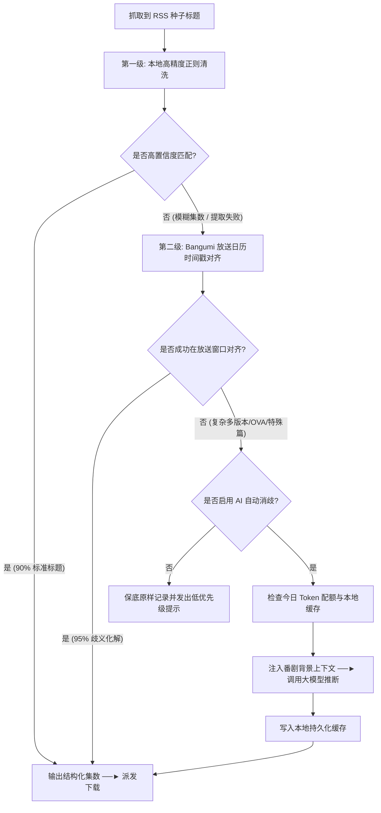

# Ani-Go 标题全自动消歧引擎与 Token 成本控制规范 (Auto-Disambiguation Engine)

## 1. 为什么单纯靠正则与纯文本 AI 解析会失效？

在动漫 BT/RSS 抓取环境中，不同发布组的命名规则存在较大差异：
1. **绝对集数混淆**：例如 `[喵萌奶茶屋] [咒术回战] [25] [1080P]`。单纯从标题字符串中无法直接确定是第 1 季的第 25 集，还是第 2 季的第 1 集；
2. **合集与多版本干扰**：`[01-04v2]`、`全12集+SP`、`10月新番` 等文本标签容易造成集数提取偏离；
3. **缺少上下文导致误判**：如果仅把单行标题文本送给大模型，由于缺乏发布周期与背景上下文，也容易出现推断偏差。

为减少人工介入并提高自动化识别准确率，Ani-Go 采用了**「三级流水线 + 官方放送日历对齐」**的消歧机制。

---

## 2. 三级消歧流水线架构

---

## 3. 第二级核心：放送时间戳对齐算法 (Air Date Grounding)

**该机制利用官方公开数据进行时间窗口比对，无需消耗大模型 Token。**

### 3.1 对齐原理
1. Ani-Go 在订阅番剧时，已同步了该番剧在 Bangumi.tv 的官方分集元数据：
   - 包含每一集的官方播出日期（`airdate`，如 `2023-10-06`）与官方集数序号（`ep_sort: 1`）。
2. RSS 种子发布时，每个条目必定携带绝对时间的发布时间戳（`pubDate`，如 `2023-10-06 23:30:00`）。
3. **容差窗口对齐规则**：
   若种子的 `pubDate` 落在某集的官方播出时间后 **0 小时 ~ 72 小时** 窗口内，且标题中包含与该集相近的数字标号，系统判定该种子对应此集。

---

## 4. 第三级核心：AI 上下文注入与配额保护机制

当遇到极少数特殊特番或时间错位的种子时，系统提供第三级 AI 兜底。针对大模型调用，Ani-Go 建立了三道保护机制：

### 4.1 明确的 UI 成本提示 (Settings Banner)
在前端设置的 AI 板块，提示相关信息：
> ⚠️ **【提示：Token 消耗与成本控制】**
> - 开启「后台自动 AI 消歧」后，遇到无法通过本地规则解析的标题时系统会调用配置的 LLM；
> - 首次订阅历史全量 RSS 时，调用频次可能略高；
> - 建议优先使用低成本模型（如 DeepSeek、Gemini Flash 或本地 Ollama）。

### 4.2 本地持久化缓存 (Persistent Cache)
- 数据库表 `parser_cache` 存储已解析的复杂标题哈希；
- 相同标题解析过一次后，结果持久化于本地 SQLite；
- 后续再次扫描该种子时直接读取缓存，无需重复调用。

### 4.3 每日调用配额限额 (Daily Quota Cap)
- 用户可在设置中配置 `AI_DAILY_QUOTA_LIMIT`（默认 30 次/天）；
- 系统维护每日计数器，一旦单日自动消歧调用达到上限，自动暂停后续大模型调用并发出提示；
- 避免异常 RSS 源造成非预期的 API 费用支出。
